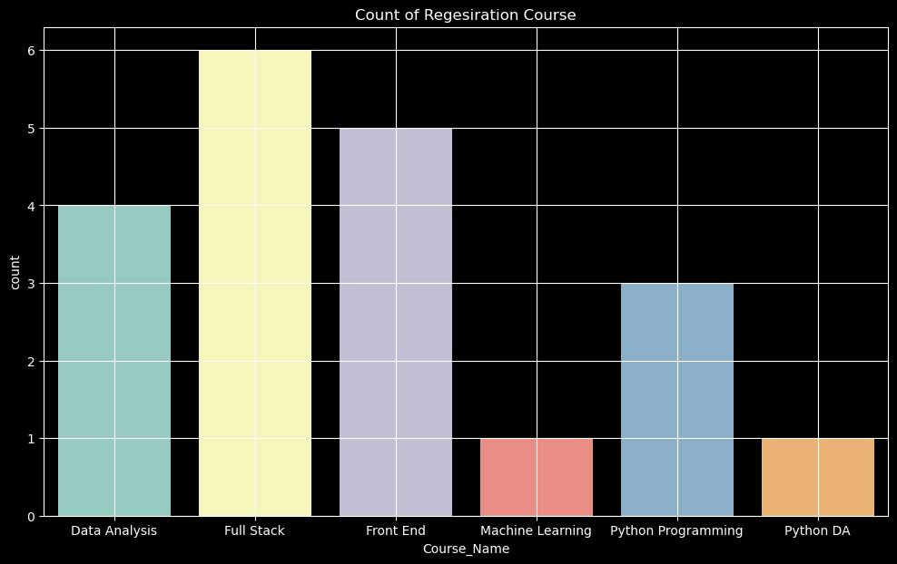
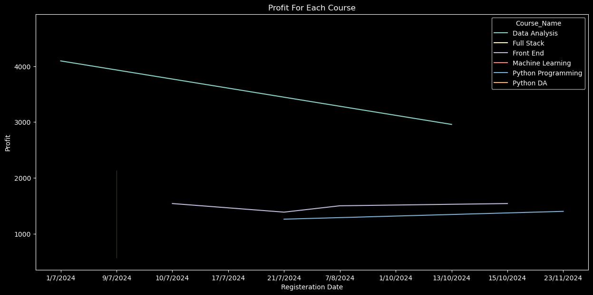
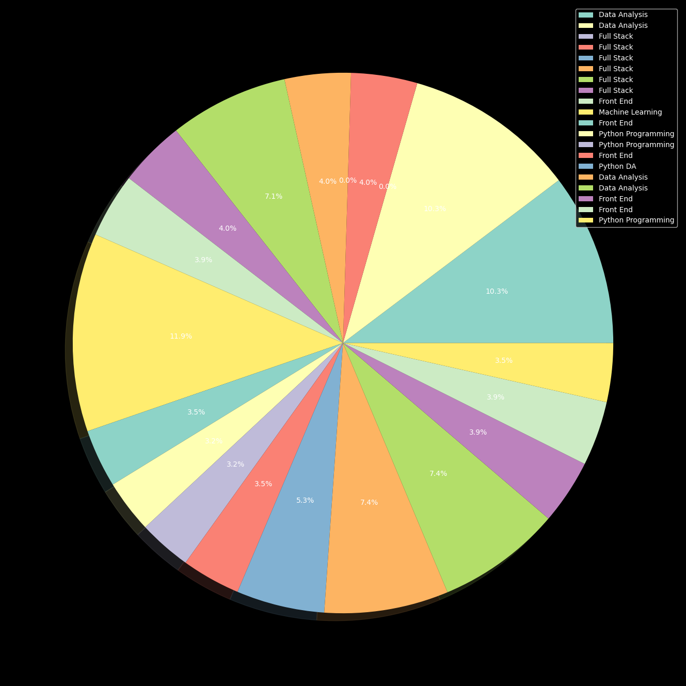
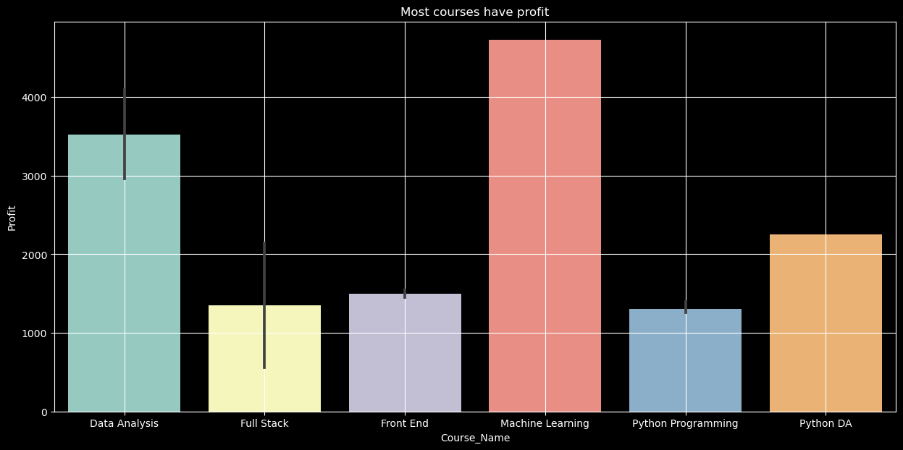
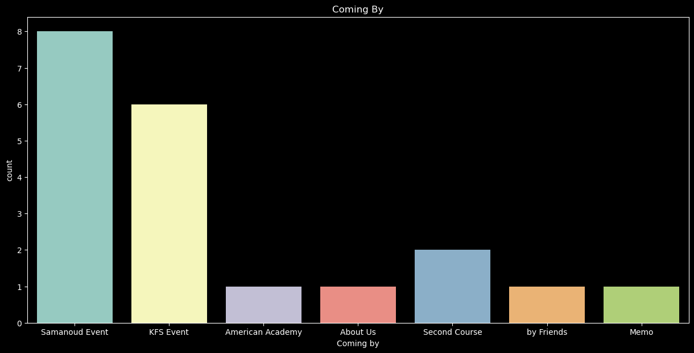
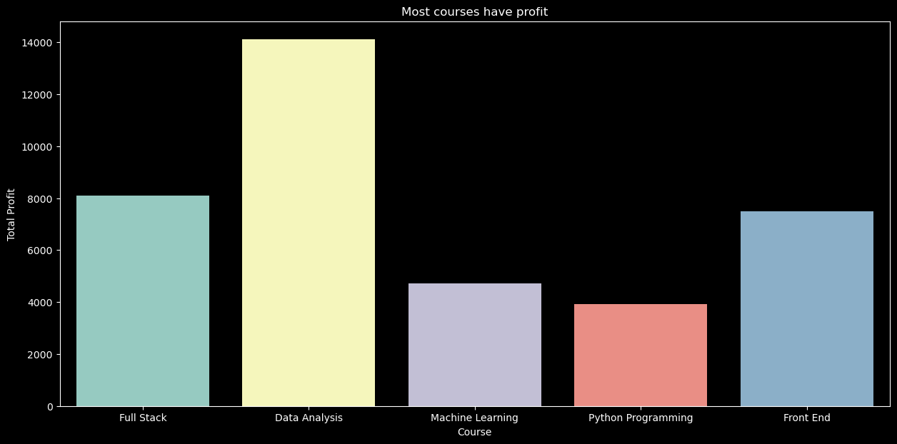
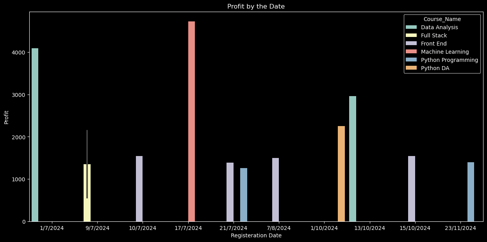
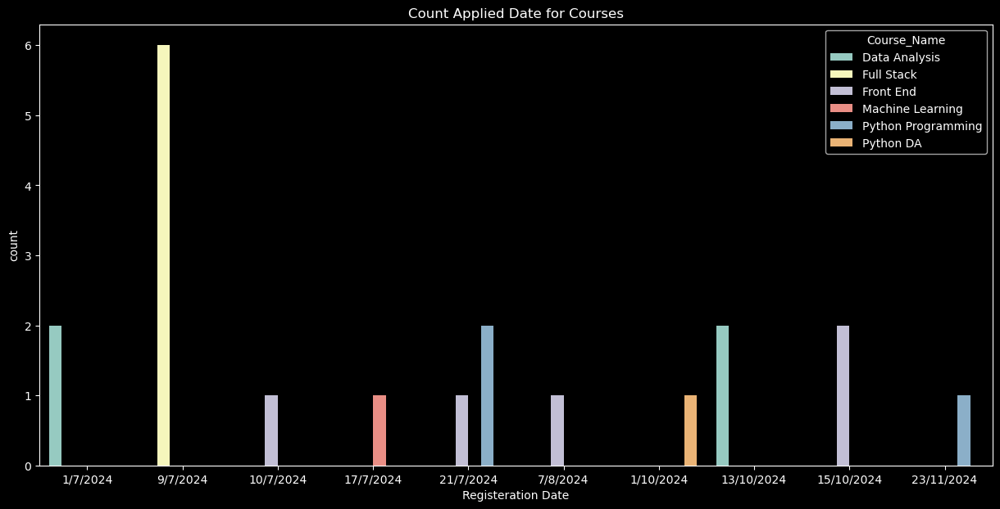

```python
import pandas as pd
```

# Creating Tables


```python
Student_ID=[1,2,3,4,5,6,7,8,9,10,11,12,13,14,15,16,17,18,19,20]
```


```python
Student_Name = [
    "Yara Mohammad", "Mohammad Diab", "Maram Emad Elwakil", "Mohammad Moghazy", "Ahmed Ashour", 
    "Gannah Beddir", "Alaa Ashraf", "AbdElrahman Elwakil", "Yousef Ayman Abu-harga", "Moemen Elsemary", 
    "Yousef Ayman El-ashmawy", "Malek Ayman Elsherkawy", "Ammar Ayman Elsherkawy", "Fares Salah", 
    "Dr.Hossam", "Malek Ayman Elsherkawy", "Ammar Ayman Elsherkawy", "Kalid Eid", "Ebrahim Gaber", 
    "Norhan El-bahrawy"
]

```


```python
Course_Name =["Data Analysis","Data Analysis" , "Full Stack","Full Stack" ,"Full Stack","Full Stack","Full Stack","Full Stack",
             "Front End","Machine Learning","Front End","Python Programming","Python Programming","Front End","Python DA",
              "Data Analysis","Data Analysis","Front End","Front End","Python Programming"]
```


```python
Location=["Samanoud","Samanoud","Kafr-Elsheikh","Kafr-Elsheikh","Kafr-Elsheikh","Kafr-Elsheikh","Kafr-Elsheikh","Kafr-Elsheikh",
         "Samanoud","Samanoud","Samanoud","Samanoud","Samanoud","Kafr-Elsheikh","Kafr-Elsheikh","Samanoud","Samanoud",
          "Samanoud","Samanoud","Samanoud"]
```


```python
Course_ID=["DA","DA","FS","FS","FS","FS","FS","FS","FE","ML","FE","PP","PP","FE","PDA","DA","DA","FE","FE","PP"]
```


```python
Coming_by=["Samanoud Event","Samanoud Event","KFS Event","KFS Event","KFS Event","KFS Event","KFS Event","KFS Event",
           "Samanoud Event","Samanoud Event","Samanoud Event","Samanoud Event","Samanoud Event","American Academy","About Us"
          ,"Second Course","Second Course","Samanoud Event" , "by Friends","Memo"]
```


```python
Registeration_Date=["1/7/2024","1/7/2024","9/7/2024","9/7/2024","9/7/2024","9/7/2024","9/7/2024","9/7/2024",
                   "10/7/2024","17/7/2024","21/7/2024","21/7/2024","21/7/2024","7/8/2024","1/10/2024" , "13/10/2024",
                   "13/10/2024","15/10/2024","15/10/2024","23/11/2024"]
```


```python
Course_Value=[6500,6500,4500,4500,4500,4500,4500,4500,2200,7500,2200,2000,2000,2000,3000,6500,6500,2200,2200,2000]
```


```python
Discount=[0.1,0.1,1,0.5,1,0.5,0.1,0.5,0,0.1,0.1,0.1,0.1,0,0,0.35,0.35,0,0,0]
```


```python
Continue=["Yes","No","Yes","Yes","Yes","No","No","Yes","No","Yes","Yes","Yes","Yes","No","Yes","Yes","Yes","Yes","Yes","Yes"]
```

# Create the dictionary


```python
Data_Base = {
    "Student_ID":[],
    "Student_Name":[],
    "Course_Name":[],
    "Location":[],
    "Course_ID":[],
    "Coming by":[],
    "Registeration Date":[],
    "Course_Value":[],
    "Discount":[],
    "Continue":[]
    
} 
```

# Adding Data to dictionary


```python
for x in Student_ID:
    Data_Base["Student_ID"].append(x)
    
    
for y in Student_Name:
    Data_Base["Student_Name"].append(y)
    
for z in Course_Name:
    Data_Base["Course_Name"].append(z)
    
for k in Location:
    Data_Base["Location"].append(k)
    
for i in Course_ID:
    Data_Base["Course_ID"].append(i)

for j in Coming_by:
    Data_Base["Coming by"].append(j)
    
for h in Registeration_Date:
    Data_Base["Registeration Date"].append(h)
    
for r in Course_Value:
    Data_Base["Course_Value"].append(r)
    
for d in Discount:
    Data_Base["Discount"].append(d)
    
for f in Continue:
    Data_Base["Continue"].append(f)
```

# Converting To Data Frame


```python
Data_Base=pd.DataFrame(Data_Base)
```


```python
Data_Base
```


<div>
<style scoped>
    .dataframe tbody tr th:only-of-type {
        vertical-align: middle;
    }

    .dataframe tbody tr th {
        vertical-align: top;
    }

    .dataframe thead th {
        text-align: right;
    }
</style>
<table border="1" class="dataframe">
  <thead>
    <tr style="text-align: right;">
      <th></th>
      <th>Student_ID</th>
      <th>Student_Name</th>
      <th>Course_Name</th>
      <th>Location</th>
      <th>Course_ID</th>
      <th>Coming by</th>
      <th>Registeration Date</th>
      <th>Course_Value</th>
      <th>Discount</th>
      <th>Continue</th>
    </tr>
  </thead>
  <tbody>
    <tr>
      <th>0</th>
      <td>1</td>
      <td>Yara Mohammad</td>
      <td>Data Analysis</td>
      <td>Samanoud</td>
      <td>DA</td>
      <td>Samanoud Event</td>
      <td>1/7/2024</td>
      <td>6500</td>
      <td>0.10</td>
      <td>Yes</td>
    </tr>
    <tr>
      <th>1</th>
      <td>2</td>
      <td>Mohammad Diab</td>
      <td>Data Analysis</td>
      <td>Samanoud</td>
      <td>DA</td>
      <td>Samanoud Event</td>
      <td>1/7/2024</td>
      <td>6500</td>
      <td>0.10</td>
      <td>No</td>
    </tr>
    <tr>
      <th>2</th>
      <td>3</td>
      <td>Maram Emad Elwakil</td>
      <td>Full Stack</td>
      <td>Kafr-Elsheikh</td>
      <td>FS</td>
      <td>KFS Event</td>
      <td>9/7/2024</td>
      <td>4500</td>
      <td>1.00</td>
      <td>Yes</td>
    </tr>
    <tr>
      <th>3</th>
      <td>4</td>
      <td>Mohammad Moghazy</td>
      <td>Full Stack</td>
      <td>Kafr-Elsheikh</td>
      <td>FS</td>
      <td>KFS Event</td>
      <td>9/7/2024</td>
      <td>4500</td>
      <td>0.50</td>
      <td>Yes</td>
    </tr>
    <tr>
      <th>4</th>
      <td>5</td>
      <td>Ahmed Ashour</td>
      <td>Full Stack</td>
      <td>Kafr-Elsheikh</td>
      <td>FS</td>
      <td>KFS Event</td>
      <td>9/7/2024</td>
      <td>4500</td>
      <td>1.00</td>
      <td>Yes</td>
    </tr>
    <tr>
      <th>5</th>
      <td>6</td>
      <td>Gannah Beddir</td>
      <td>Full Stack</td>
      <td>Kafr-Elsheikh</td>
      <td>FS</td>
      <td>KFS Event</td>
      <td>9/7/2024</td>
      <td>4500</td>
      <td>0.50</td>
      <td>No</td>
    </tr>
    <tr>
      <th>6</th>
      <td>7</td>
      <td>Alaa Ashraf</td>
      <td>Full Stack</td>
      <td>Kafr-Elsheikh</td>
      <td>FS</td>
      <td>KFS Event</td>
      <td>9/7/2024</td>
      <td>4500</td>
      <td>0.10</td>
      <td>No</td>
    </tr>
    <tr>
      <th>7</th>
      <td>8</td>
      <td>AbdElrahman Elwakil</td>
      <td>Full Stack</td>
      <td>Kafr-Elsheikh</td>
      <td>FS</td>
      <td>KFS Event</td>
      <td>9/7/2024</td>
      <td>4500</td>
      <td>0.50</td>
      <td>Yes</td>
    </tr>
    <tr>
      <th>8</th>
      <td>9</td>
      <td>Yousef Ayman Abu-harga</td>
      <td>Front End</td>
      <td>Samanoud</td>
      <td>FE</td>
      <td>Samanoud Event</td>
      <td>10/7/2024</td>
      <td>2200</td>
      <td>0.00</td>
      <td>No</td>
    </tr>
    <tr>
      <th>9</th>
      <td>10</td>
      <td>Moemen Elsemary</td>
      <td>Machine Learning</td>
      <td>Samanoud</td>
      <td>ML</td>
      <td>Samanoud Event</td>
      <td>17/7/2024</td>
      <td>7500</td>
      <td>0.10</td>
      <td>Yes</td>
    </tr>
    <tr>
      <th>10</th>
      <td>11</td>
      <td>Yousef Ayman El-ashmawy</td>
      <td>Front End</td>
      <td>Samanoud</td>
      <td>FE</td>
      <td>Samanoud Event</td>
      <td>21/7/2024</td>
      <td>2200</td>
      <td>0.10</td>
      <td>Yes</td>
    </tr>
    <tr>
      <th>11</th>
      <td>12</td>
      <td>Malek Ayman Elsherkawy</td>
      <td>Python Programming</td>
      <td>Samanoud</td>
      <td>PP</td>
      <td>Samanoud Event</td>
      <td>21/7/2024</td>
      <td>2000</td>
      <td>0.10</td>
      <td>Yes</td>
    </tr>
    <tr>
      <th>12</th>
      <td>13</td>
      <td>Ammar Ayman Elsherkawy</td>
      <td>Python Programming</td>
      <td>Samanoud</td>
      <td>PP</td>
      <td>Samanoud Event</td>
      <td>21/7/2024</td>
      <td>2000</td>
      <td>0.10</td>
      <td>Yes</td>
    </tr>
    <tr>
      <th>13</th>
      <td>14</td>
      <td>Fares Salah</td>
      <td>Front End</td>
      <td>Kafr-Elsheikh</td>
      <td>FE</td>
      <td>American Academy</td>
      <td>7/8/2024</td>
      <td>2000</td>
      <td>0.00</td>
      <td>No</td>
    </tr>
    <tr>
      <th>14</th>
      <td>15</td>
      <td>Dr.Hossam</td>
      <td>Python DA</td>
      <td>Kafr-Elsheikh</td>
      <td>PDA</td>
      <td>About Us</td>
      <td>1/10/2024</td>
      <td>3000</td>
      <td>0.00</td>
      <td>Yes</td>
    </tr>
    <tr>
      <th>15</th>
      <td>16</td>
      <td>Malek Ayman Elsherkawy</td>
      <td>Data Analysis</td>
      <td>Samanoud</td>
      <td>DA</td>
      <td>Second Course</td>
      <td>13/10/2024</td>
      <td>6500</td>
      <td>0.35</td>
      <td>Yes</td>
    </tr>
    <tr>
      <th>16</th>
      <td>17</td>
      <td>Ammar Ayman Elsherkawy</td>
      <td>Data Analysis</td>
      <td>Samanoud</td>
      <td>DA</td>
      <td>Second Course</td>
      <td>13/10/2024</td>
      <td>6500</td>
      <td>0.35</td>
      <td>Yes</td>
    </tr>
    <tr>
      <th>17</th>
      <td>18</td>
      <td>Kalid Eid</td>
      <td>Front End</td>
      <td>Samanoud</td>
      <td>FE</td>
      <td>Samanoud Event</td>
      <td>15/10/2024</td>
      <td>2200</td>
      <td>0.00</td>
      <td>Yes</td>
    </tr>
    <tr>
      <th>18</th>
      <td>19</td>
      <td>Ebrahim Gaber</td>
      <td>Front End</td>
      <td>Samanoud</td>
      <td>FE</td>
      <td>by Friends</td>
      <td>15/10/2024</td>
      <td>2200</td>
      <td>0.00</td>
      <td>Yes</td>
    </tr>
    <tr>
      <th>19</th>
      <td>20</td>
      <td>Norhan El-bahrawy</td>
      <td>Python Programming</td>
      <td>Samanoud</td>
      <td>PP</td>
      <td>Memo</td>
      <td>23/11/2024</td>
      <td>2000</td>
      <td>0.00</td>
      <td>Yes</td>
    </tr>
  </tbody>
</table>
</div>


# Calculate Specific Columns


```python
Data_Base["Values After Discount"] = Data_Base["Course_Value"]-(Data_Base["Course_Value"]*Data_Base["Discount"])
```


```python
Data_Base
```


<div>
<style scoped>
    .dataframe tbody tr th:only-of-type {
        vertical-align: middle;
    }

    .dataframe tbody tr th {
        vertical-align: top;
    }

    .dataframe thead th {
        text-align: right;
    }
</style>
<table border="1" class="dataframe">
  <thead>
    <tr style="text-align: right;">
      <th></th>
      <th>Student_ID</th>
      <th>Student_Name</th>
      <th>Course_Name</th>
      <th>Location</th>
      <th>Course_ID</th>
      <th>Coming by</th>
      <th>Registeration Date</th>
      <th>Course_Value</th>
      <th>Discount</th>
      <th>Continue</th>
      <th>Values After Discount</th>
    </tr>
  </thead>
  <tbody>
    <tr>
      <th>0</th>
      <td>1</td>
      <td>Yara Mohammad</td>
      <td>Data Analysis</td>
      <td>Samanoud</td>
      <td>DA</td>
      <td>Samanoud Event</td>
      <td>1/7/2024</td>
      <td>6500</td>
      <td>0.10</td>
      <td>Yes</td>
      <td>5850.0</td>
    </tr>
    <tr>
      <th>1</th>
      <td>2</td>
      <td>Mohammad Diab</td>
      <td>Data Analysis</td>
      <td>Samanoud</td>
      <td>DA</td>
      <td>Samanoud Event</td>
      <td>1/7/2024</td>
      <td>6500</td>
      <td>0.10</td>
      <td>No</td>
      <td>5850.0</td>
    </tr>
    <tr>
      <th>2</th>
      <td>3</td>
      <td>Maram Emad Elwakil</td>
      <td>Full Stack</td>
      <td>Kafr-Elsheikh</td>
      <td>FS</td>
      <td>KFS Event</td>
      <td>9/7/2024</td>
      <td>4500</td>
      <td>1.00</td>
      <td>Yes</td>
      <td>0.0</td>
    </tr>
    <tr>
      <th>3</th>
      <td>4</td>
      <td>Mohammad Moghazy</td>
      <td>Full Stack</td>
      <td>Kafr-Elsheikh</td>
      <td>FS</td>
      <td>KFS Event</td>
      <td>9/7/2024</td>
      <td>4500</td>
      <td>0.50</td>
      <td>Yes</td>
      <td>2250.0</td>
    </tr>
    <tr>
      <th>4</th>
      <td>5</td>
      <td>Ahmed Ashour</td>
      <td>Full Stack</td>
      <td>Kafr-Elsheikh</td>
      <td>FS</td>
      <td>KFS Event</td>
      <td>9/7/2024</td>
      <td>4500</td>
      <td>1.00</td>
      <td>Yes</td>
      <td>0.0</td>
    </tr>
    <tr>
      <th>5</th>
      <td>6</td>
      <td>Gannah Beddir</td>
      <td>Full Stack</td>
      <td>Kafr-Elsheikh</td>
      <td>FS</td>
      <td>KFS Event</td>
      <td>9/7/2024</td>
      <td>4500</td>
      <td>0.50</td>
      <td>No</td>
      <td>2250.0</td>
    </tr>
    <tr>
      <th>6</th>
      <td>7</td>
      <td>Alaa Ashraf</td>
      <td>Full Stack</td>
      <td>Kafr-Elsheikh</td>
      <td>FS</td>
      <td>KFS Event</td>
      <td>9/7/2024</td>
      <td>4500</td>
      <td>0.10</td>
      <td>No</td>
      <td>4050.0</td>
    </tr>
    <tr>
      <th>7</th>
      <td>8</td>
      <td>AbdElrahman Elwakil</td>
      <td>Full Stack</td>
      <td>Kafr-Elsheikh</td>
      <td>FS</td>
      <td>KFS Event</td>
      <td>9/7/2024</td>
      <td>4500</td>
      <td>0.50</td>
      <td>Yes</td>
      <td>2250.0</td>
    </tr>
    <tr>
      <th>8</th>
      <td>9</td>
      <td>Yousef Ayman Abu-harga</td>
      <td>Front End</td>
      <td>Samanoud</td>
      <td>FE</td>
      <td>Samanoud Event</td>
      <td>10/7/2024</td>
      <td>2200</td>
      <td>0.00</td>
      <td>No</td>
      <td>2200.0</td>
    </tr>
    <tr>
      <th>9</th>
      <td>10</td>
      <td>Moemen Elsemary</td>
      <td>Machine Learning</td>
      <td>Samanoud</td>
      <td>ML</td>
      <td>Samanoud Event</td>
      <td>17/7/2024</td>
      <td>7500</td>
      <td>0.10</td>
      <td>Yes</td>
      <td>6750.0</td>
    </tr>
    <tr>
      <th>10</th>
      <td>11</td>
      <td>Yousef Ayman El-ashmawy</td>
      <td>Front End</td>
      <td>Samanoud</td>
      <td>FE</td>
      <td>Samanoud Event</td>
      <td>21/7/2024</td>
      <td>2200</td>
      <td>0.10</td>
      <td>Yes</td>
      <td>1980.0</td>
    </tr>
    <tr>
      <th>11</th>
      <td>12</td>
      <td>Malek Ayman Elsherkawy</td>
      <td>Python Programming</td>
      <td>Samanoud</td>
      <td>PP</td>
      <td>Samanoud Event</td>
      <td>21/7/2024</td>
      <td>2000</td>
      <td>0.10</td>
      <td>Yes</td>
      <td>1800.0</td>
    </tr>
    <tr>
      <th>12</th>
      <td>13</td>
      <td>Ammar Ayman Elsherkawy</td>
      <td>Python Programming</td>
      <td>Samanoud</td>
      <td>PP</td>
      <td>Samanoud Event</td>
      <td>21/7/2024</td>
      <td>2000</td>
      <td>0.10</td>
      <td>Yes</td>
      <td>1800.0</td>
    </tr>
    <tr>
      <th>13</th>
      <td>14</td>
      <td>Fares Salah</td>
      <td>Front End</td>
      <td>Kafr-Elsheikh</td>
      <td>FE</td>
      <td>American Academy</td>
      <td>7/8/2024</td>
      <td>2000</td>
      <td>0.00</td>
      <td>No</td>
      <td>2000.0</td>
    </tr>
    <tr>
      <th>14</th>
      <td>15</td>
      <td>Dr.Hossam</td>
      <td>Python DA</td>
      <td>Kafr-Elsheikh</td>
      <td>PDA</td>
      <td>About Us</td>
      <td>1/10/2024</td>
      <td>3000</td>
      <td>0.00</td>
      <td>Yes</td>
      <td>3000.0</td>
    </tr>
    <tr>
      <th>15</th>
      <td>16</td>
      <td>Malek Ayman Elsherkawy</td>
      <td>Data Analysis</td>
      <td>Samanoud</td>
      <td>DA</td>
      <td>Second Course</td>
      <td>13/10/2024</td>
      <td>6500</td>
      <td>0.35</td>
      <td>Yes</td>
      <td>4225.0</td>
    </tr>
    <tr>
      <th>16</th>
      <td>17</td>
      <td>Ammar Ayman Elsherkawy</td>
      <td>Data Analysis</td>
      <td>Samanoud</td>
      <td>DA</td>
      <td>Second Course</td>
      <td>13/10/2024</td>
      <td>6500</td>
      <td>0.35</td>
      <td>Yes</td>
      <td>4225.0</td>
    </tr>
    <tr>
      <th>17</th>
      <td>18</td>
      <td>Kalid Eid</td>
      <td>Front End</td>
      <td>Samanoud</td>
      <td>FE</td>
      <td>Samanoud Event</td>
      <td>15/10/2024</td>
      <td>2200</td>
      <td>0.00</td>
      <td>Yes</td>
      <td>2200.0</td>
    </tr>
    <tr>
      <th>18</th>
      <td>19</td>
      <td>Ebrahim Gaber</td>
      <td>Front End</td>
      <td>Samanoud</td>
      <td>FE</td>
      <td>by Friends</td>
      <td>15/10/2024</td>
      <td>2200</td>
      <td>0.00</td>
      <td>Yes</td>
      <td>2200.0</td>
    </tr>
    <tr>
      <th>19</th>
      <td>20</td>
      <td>Norhan El-bahrawy</td>
      <td>Python Programming</td>
      <td>Samanoud</td>
      <td>PP</td>
      <td>Memo</td>
      <td>23/11/2024</td>
      <td>2000</td>
      <td>0.00</td>
      <td>Yes</td>
      <td>2000.0</td>
    </tr>
  </tbody>
</table>
</div>


```python
Data_Base["Partener Percentage"] = [0.3,0.3,0.25,0.25,0.25,0.25,0.25,0.25,0.3,0.3,0.3,0.3,0.3,0.25,0.25,0.3,0.3,0.3,0.3,0.3]
```


```python
Data_Base["Partener Values"]=Data_Base["Partener Percentage"]*Data_Base["Values After Discount"]
```


```python
Data_Base["Profit"]=Data_Base["Values After Discount"]-Data_Base["Partener Values"]
```


```python
Data_Base
```


<div>
<style scoped>
    .dataframe tbody tr th:only-of-type {
        vertical-align: middle;
    }

    .dataframe tbody tr th {
        vertical-align: top;
    }

    .dataframe thead th {
        text-align: right;
    }
</style>
<table border="1" class="dataframe">
  <thead>
    <tr style="text-align: right;">
      <th></th>
      <th>Student_ID</th>
      <th>Student_Name</th>
      <th>Course_Name</th>
      <th>Location</th>
      <th>Course_ID</th>
      <th>Coming by</th>
      <th>Registeration Date</th>
      <th>Course_Value</th>
      <th>Discount</th>
      <th>Continue</th>
      <th>Values After Discount</th>
      <th>Partener Percentage</th>
      <th>Partener Values</th>
      <th>Profit</th>
    </tr>
  </thead>
  <tbody>
    <tr>
      <th>0</th>
      <td>1</td>
      <td>Yara Mohammad</td>
      <td>Data Analysis</td>
      <td>Samanoud</td>
      <td>DA</td>
      <td>Samanoud Event</td>
      <td>1/7/2024</td>
      <td>6500</td>
      <td>0.10</td>
      <td>Yes</td>
      <td>5850.0</td>
      <td>0.30</td>
      <td>1755.0</td>
      <td>4095.0</td>
    </tr>
    <tr>
      <th>1</th>
      <td>2</td>
      <td>Mohammad Diab</td>
      <td>Data Analysis</td>
      <td>Samanoud</td>
      <td>DA</td>
      <td>Samanoud Event</td>
      <td>1/7/2024</td>
      <td>6500</td>
      <td>0.10</td>
      <td>No</td>
      <td>5850.0</td>
      <td>0.30</td>
      <td>1755.0</td>
      <td>4095.0</td>
    </tr>
    <tr>
      <th>2</th>
      <td>3</td>
      <td>Maram Emad Elwakil</td>
      <td>Full Stack</td>
      <td>Kafr-Elsheikh</td>
      <td>FS</td>
      <td>KFS Event</td>
      <td>9/7/2024</td>
      <td>4500</td>
      <td>1.00</td>
      <td>Yes</td>
      <td>0.0</td>
      <td>0.25</td>
      <td>0.0</td>
      <td>0.0</td>
    </tr>
    <tr>
      <th>3</th>
      <td>4</td>
      <td>Mohammad Moghazy</td>
      <td>Full Stack</td>
      <td>Kafr-Elsheikh</td>
      <td>FS</td>
      <td>KFS Event</td>
      <td>9/7/2024</td>
      <td>4500</td>
      <td>0.50</td>
      <td>Yes</td>
      <td>2250.0</td>
      <td>0.25</td>
      <td>562.5</td>
      <td>1687.5</td>
    </tr>
    <tr>
      <th>4</th>
      <td>5</td>
      <td>Ahmed Ashour</td>
      <td>Full Stack</td>
      <td>Kafr-Elsheikh</td>
      <td>FS</td>
      <td>KFS Event</td>
      <td>9/7/2024</td>
      <td>4500</td>
      <td>1.00</td>
      <td>Yes</td>
      <td>0.0</td>
      <td>0.25</td>
      <td>0.0</td>
      <td>0.0</td>
    </tr>
    <tr>
      <th>5</th>
      <td>6</td>
      <td>Gannah Beddir</td>
      <td>Full Stack</td>
      <td>Kafr-Elsheikh</td>
      <td>FS</td>
      <td>KFS Event</td>
      <td>9/7/2024</td>
      <td>4500</td>
      <td>0.50</td>
      <td>No</td>
      <td>2250.0</td>
      <td>0.25</td>
      <td>562.5</td>
      <td>1687.5</td>
    </tr>
    <tr>
      <th>6</th>
      <td>7</td>
      <td>Alaa Ashraf</td>
      <td>Full Stack</td>
      <td>Kafr-Elsheikh</td>
      <td>FS</td>
      <td>KFS Event</td>
      <td>9/7/2024</td>
      <td>4500</td>
      <td>0.10</td>
      <td>No</td>
      <td>4050.0</td>
      <td>0.25</td>
      <td>1012.5</td>
      <td>3037.5</td>
    </tr>
    <tr>
      <th>7</th>
      <td>8</td>
      <td>AbdElrahman Elwakil</td>
      <td>Full Stack</td>
      <td>Kafr-Elsheikh</td>
      <td>FS</td>
      <td>KFS Event</td>
      <td>9/7/2024</td>
      <td>4500</td>
      <td>0.50</td>
      <td>Yes</td>
      <td>2250.0</td>
      <td>0.25</td>
      <td>562.5</td>
      <td>1687.5</td>
    </tr>
    <tr>
      <th>8</th>
      <td>9</td>
      <td>Yousef Ayman Abu-harga</td>
      <td>Front End</td>
      <td>Samanoud</td>
      <td>FE</td>
      <td>Samanoud Event</td>
      <td>10/7/2024</td>
      <td>2200</td>
      <td>0.00</td>
      <td>No</td>
      <td>2200.0</td>
      <td>0.30</td>
      <td>660.0</td>
      <td>1540.0</td>
    </tr>
    <tr>
      <th>9</th>
      <td>10</td>
      <td>Moemen Elsemary</td>
      <td>Machine Learning</td>
      <td>Samanoud</td>
      <td>ML</td>
      <td>Samanoud Event</td>
      <td>17/7/2024</td>
      <td>7500</td>
      <td>0.10</td>
      <td>Yes</td>
      <td>6750.0</td>
      <td>0.30</td>
      <td>2025.0</td>
      <td>4725.0</td>
    </tr>
    <tr>
      <th>10</th>
      <td>11</td>
      <td>Yousef Ayman El-ashmawy</td>
      <td>Front End</td>
      <td>Samanoud</td>
      <td>FE</td>
      <td>Samanoud Event</td>
      <td>21/7/2024</td>
      <td>2200</td>
      <td>0.10</td>
      <td>Yes</td>
      <td>1980.0</td>
      <td>0.30</td>
      <td>594.0</td>
      <td>1386.0</td>
    </tr>
    <tr>
      <th>11</th>
      <td>12</td>
      <td>Malek Ayman Elsherkawy</td>
      <td>Python Programming</td>
      <td>Samanoud</td>
      <td>PP</td>
      <td>Samanoud Event</td>
      <td>21/7/2024</td>
      <td>2000</td>
      <td>0.10</td>
      <td>Yes</td>
      <td>1800.0</td>
      <td>0.30</td>
      <td>540.0</td>
      <td>1260.0</td>
    </tr>
    <tr>
      <th>12</th>
      <td>13</td>
      <td>Ammar Ayman Elsherkawy</td>
      <td>Python Programming</td>
      <td>Samanoud</td>
      <td>PP</td>
      <td>Samanoud Event</td>
      <td>21/7/2024</td>
      <td>2000</td>
      <td>0.10</td>
      <td>Yes</td>
      <td>1800.0</td>
      <td>0.30</td>
      <td>540.0</td>
      <td>1260.0</td>
    </tr>
    <tr>
      <th>13</th>
      <td>14</td>
      <td>Fares Salah</td>
      <td>Front End</td>
      <td>Kafr-Elsheikh</td>
      <td>FE</td>
      <td>American Academy</td>
      <td>7/8/2024</td>
      <td>2000</td>
      <td>0.00</td>
      <td>No</td>
      <td>2000.0</td>
      <td>0.25</td>
      <td>500.0</td>
      <td>1500.0</td>
    </tr>
    <tr>
      <th>14</th>
      <td>15</td>
      <td>Dr.Hossam</td>
      <td>Python DA</td>
      <td>Kafr-Elsheikh</td>
      <td>PDA</td>
      <td>About Us</td>
      <td>1/10/2024</td>
      <td>3000</td>
      <td>0.00</td>
      <td>Yes</td>
      <td>3000.0</td>
      <td>0.25</td>
      <td>750.0</td>
      <td>2250.0</td>
    </tr>
    <tr>
      <th>15</th>
      <td>16</td>
      <td>Malek Ayman Elsherkawy</td>
      <td>Data Analysis</td>
      <td>Samanoud</td>
      <td>DA</td>
      <td>Second Course</td>
      <td>13/10/2024</td>
      <td>6500</td>
      <td>0.35</td>
      <td>Yes</td>
      <td>4225.0</td>
      <td>0.30</td>
      <td>1267.5</td>
      <td>2957.5</td>
    </tr>
    <tr>
      <th>16</th>
      <td>17</td>
      <td>Ammar Ayman Elsherkawy</td>
      <td>Data Analysis</td>
      <td>Samanoud</td>
      <td>DA</td>
      <td>Second Course</td>
      <td>13/10/2024</td>
      <td>6500</td>
      <td>0.35</td>
      <td>Yes</td>
      <td>4225.0</td>
      <td>0.30</td>
      <td>1267.5</td>
      <td>2957.5</td>
    </tr>
    <tr>
      <th>17</th>
      <td>18</td>
      <td>Kalid Eid</td>
      <td>Front End</td>
      <td>Samanoud</td>
      <td>FE</td>
      <td>Samanoud Event</td>
      <td>15/10/2024</td>
      <td>2200</td>
      <td>0.00</td>
      <td>Yes</td>
      <td>2200.0</td>
      <td>0.30</td>
      <td>660.0</td>
      <td>1540.0</td>
    </tr>
    <tr>
      <th>18</th>
      <td>19</td>
      <td>Ebrahim Gaber</td>
      <td>Front End</td>
      <td>Samanoud</td>
      <td>FE</td>
      <td>by Friends</td>
      <td>15/10/2024</td>
      <td>2200</td>
      <td>0.00</td>
      <td>Yes</td>
      <td>2200.0</td>
      <td>0.30</td>
      <td>660.0</td>
      <td>1540.0</td>
    </tr>
    <tr>
      <th>19</th>
      <td>20</td>
      <td>Norhan El-bahrawy</td>
      <td>Python Programming</td>
      <td>Samanoud</td>
      <td>PP</td>
      <td>Memo</td>
      <td>23/11/2024</td>
      <td>2000</td>
      <td>0.00</td>
      <td>Yes</td>
      <td>2000.0</td>
      <td>0.30</td>
      <td>600.0</td>
      <td>1400.0</td>
    </tr>
  </tbody>
</table>
</div>


# EDA


```python
import seaborn as sns 
import matplotlib.pyplot as plt
plt.style.use("dark_background")
import numpy as np
```


```python
Data_Base.describe()
```


<div>
<style scoped>
    .dataframe tbody tr th:only-of-type {
        vertical-align: middle;
    }

    .dataframe tbody tr th {
        vertical-align: top;
    }

    .dataframe thead th {
        text-align: right;
    }
</style>
<table border="1" class="dataframe">
  <thead>
    <tr style="text-align: right;">
      <th></th>
      <th>Student_ID</th>
      <th>Course_Value</th>
      <th>Discount</th>
      <th>Values After Discount</th>
      <th>Partener Percentage</th>
      <th>Partener Values</th>
      <th>Profit</th>
    </tr>
  </thead>
  <tbody>
    <tr>
      <th>count</th>
      <td>20.00000</td>
      <td>20.00000</td>
      <td>20.00000</td>
      <td>20.000000</td>
      <td>20.000000</td>
      <td>20.00000</td>
      <td>20.00000</td>
    </tr>
    <tr>
      <th>mean</th>
      <td>10.50000</td>
      <td>4015.00000</td>
      <td>0.24500</td>
      <td>2844.000000</td>
      <td>0.280000</td>
      <td>813.70000</td>
      <td>2030.30000</td>
    </tr>
    <tr>
      <th>std</th>
      <td>5.91608</td>
      <td>1901.59905</td>
      <td>0.31326</td>
      <td>1798.426652</td>
      <td>0.025131</td>
      <td>543.93037</td>
      <td>1260.07094</td>
    </tr>
    <tr>
      <th>min</th>
      <td>1.00000</td>
      <td>2000.00000</td>
      <td>0.00000</td>
      <td>0.000000</td>
      <td>0.250000</td>
      <td>0.00000</td>
      <td>0.00000</td>
    </tr>
    <tr>
      <th>25%</th>
      <td>5.75000</td>
      <td>2200.00000</td>
      <td>0.00000</td>
      <td>1995.000000</td>
      <td>0.250000</td>
      <td>556.87500</td>
      <td>1396.50000</td>
    </tr>
    <tr>
      <th>50%</th>
      <td>10.50000</td>
      <td>4500.00000</td>
      <td>0.10000</td>
      <td>2225.000000</td>
      <td>0.300000</td>
      <td>630.00000</td>
      <td>1613.75000</td>
    </tr>
    <tr>
      <th>75%</th>
      <td>15.25000</td>
      <td>5000.00000</td>
      <td>0.38750</td>
      <td>4093.750000</td>
      <td>0.300000</td>
      <td>1076.25000</td>
      <td>2957.50000</td>
    </tr>
    <tr>
      <th>max</th>
      <td>20.00000</td>
      <td>7500.00000</td>
      <td>1.00000</td>
      <td>6750.000000</td>
      <td>0.300000</td>
      <td>2025.00000</td>
      <td>4725.00000</td>
    </tr>
  </tbody>
</table>
</div>


- Max profit = 4725 LE 
 - Min Profit = 0 LE


```python
Most10_Courses_Profit = Data_Base.sort_values("Profit", ascending=False).head(10)
```


```python
Most10_Courses_Profit
```


<div>
<style scoped>
    .dataframe tbody tr th:only-of-type {
        vertical-align: middle;
    }

    .dataframe tbody tr th {
        vertical-align: top;
    }

    .dataframe thead th {
        text-align: right;
    }
</style>
<table border="1" class="dataframe">
  <thead>
    <tr style="text-align: right;">
      <th></th>
      <th>Student_ID</th>
      <th>Student_Name</th>
      <th>Course_Name</th>
      <th>Location</th>
      <th>Course_ID</th>
      <th>Coming by</th>
      <th>Registeration Date</th>
      <th>Course_Value</th>
      <th>Discount</th>
      <th>Continue</th>
      <th>Values After Discount</th>
      <th>Partener Percentage</th>
      <th>Partener Values</th>
      <th>Profit</th>
    </tr>
  </thead>
  <tbody>
    <tr>
      <th>9</th>
      <td>10</td>
      <td>Moemen Elsemary</td>
      <td>Machine Learning</td>
      <td>Samanoud</td>
      <td>ML</td>
      <td>Samanoud Event</td>
      <td>17/7/2024</td>
      <td>7500</td>
      <td>0.10</td>
      <td>Yes</td>
      <td>6750.0</td>
      <td>0.30</td>
      <td>2025.0</td>
      <td>4725.0</td>
    </tr>
    <tr>
      <th>0</th>
      <td>1</td>
      <td>Yara Mohammad</td>
      <td>Data Analysis</td>
      <td>Samanoud</td>
      <td>DA</td>
      <td>Samanoud Event</td>
      <td>1/7/2024</td>
      <td>6500</td>
      <td>0.10</td>
      <td>Yes</td>
      <td>5850.0</td>
      <td>0.30</td>
      <td>1755.0</td>
      <td>4095.0</td>
    </tr>
    <tr>
      <th>1</th>
      <td>2</td>
      <td>Mohammad Diab</td>
      <td>Data Analysis</td>
      <td>Samanoud</td>
      <td>DA</td>
      <td>Samanoud Event</td>
      <td>1/7/2024</td>
      <td>6500</td>
      <td>0.10</td>
      <td>No</td>
      <td>5850.0</td>
      <td>0.30</td>
      <td>1755.0</td>
      <td>4095.0</td>
    </tr>
    <tr>
      <th>6</th>
      <td>7</td>
      <td>Alaa Ashraf</td>
      <td>Full Stack</td>
      <td>Kafr-Elsheikh</td>
      <td>FS</td>
      <td>KFS Event</td>
      <td>9/7/2024</td>
      <td>4500</td>
      <td>0.10</td>
      <td>No</td>
      <td>4050.0</td>
      <td>0.25</td>
      <td>1012.5</td>
      <td>3037.5</td>
    </tr>
    <tr>
      <th>16</th>
      <td>17</td>
      <td>Ammar Ayman Elsherkawy</td>
      <td>Data Analysis</td>
      <td>Samanoud</td>
      <td>DA</td>
      <td>Second Course</td>
      <td>13/10/2024</td>
      <td>6500</td>
      <td>0.35</td>
      <td>Yes</td>
      <td>4225.0</td>
      <td>0.30</td>
      <td>1267.5</td>
      <td>2957.5</td>
    </tr>
    <tr>
      <th>15</th>
      <td>16</td>
      <td>Malek Ayman Elsherkawy</td>
      <td>Data Analysis</td>
      <td>Samanoud</td>
      <td>DA</td>
      <td>Second Course</td>
      <td>13/10/2024</td>
      <td>6500</td>
      <td>0.35</td>
      <td>Yes</td>
      <td>4225.0</td>
      <td>0.30</td>
      <td>1267.5</td>
      <td>2957.5</td>
    </tr>
    <tr>
      <th>14</th>
      <td>15</td>
      <td>Dr.Hossam</td>
      <td>Python DA</td>
      <td>Kafr-Elsheikh</td>
      <td>PDA</td>
      <td>About Us</td>
      <td>1/10/2024</td>
      <td>3000</td>
      <td>0.00</td>
      <td>Yes</td>
      <td>3000.0</td>
      <td>0.25</td>
      <td>750.0</td>
      <td>2250.0</td>
    </tr>
    <tr>
      <th>3</th>
      <td>4</td>
      <td>Mohammad Moghazy</td>
      <td>Full Stack</td>
      <td>Kafr-Elsheikh</td>
      <td>FS</td>
      <td>KFS Event</td>
      <td>9/7/2024</td>
      <td>4500</td>
      <td>0.50</td>
      <td>Yes</td>
      <td>2250.0</td>
      <td>0.25</td>
      <td>562.5</td>
      <td>1687.5</td>
    </tr>
    <tr>
      <th>5</th>
      <td>6</td>
      <td>Gannah Beddir</td>
      <td>Full Stack</td>
      <td>Kafr-Elsheikh</td>
      <td>FS</td>
      <td>KFS Event</td>
      <td>9/7/2024</td>
      <td>4500</td>
      <td>0.50</td>
      <td>No</td>
      <td>2250.0</td>
      <td>0.25</td>
      <td>562.5</td>
      <td>1687.5</td>
    </tr>
    <tr>
      <th>7</th>
      <td>8</td>
      <td>AbdElrahman Elwakil</td>
      <td>Full Stack</td>
      <td>Kafr-Elsheikh</td>
      <td>FS</td>
      <td>KFS Event</td>
      <td>9/7/2024</td>
      <td>4500</td>
      <td>0.50</td>
      <td>Yes</td>
      <td>2250.0</td>
      <td>0.25</td>
      <td>562.5</td>
      <td>1687.5</td>
    </tr>
  </tbody>
</table>
</div>


```python
least5_Courses_Profit = Data_Base.sort_values("Profit", ascending=True).head(5)
```


```python
least5_Courses_Profit
```


<div>
<style scoped>
    .dataframe tbody tr th:only-of-type {
        vertical-align: middle;
    }

    .dataframe tbody tr th {
        vertical-align: top;
    }

    .dataframe thead th {
        text-align: right;
    }
</style>
<table border="1" class="dataframe">
  <thead>
    <tr style="text-align: right;">
      <th></th>
      <th>Student_ID</th>
      <th>Student_Name</th>
      <th>Course_Name</th>
      <th>Location</th>
      <th>Course_ID</th>
      <th>Coming by</th>
      <th>Registeration Date</th>
      <th>Course_Value</th>
      <th>Discount</th>
      <th>Continue</th>
      <th>Values After Discount</th>
      <th>Partener Percentage</th>
      <th>Partener Values</th>
      <th>Profit</th>
    </tr>
  </thead>
  <tbody>
    <tr>
      <th>2</th>
      <td>3</td>
      <td>Maram Emad Elwakil</td>
      <td>Full Stack</td>
      <td>Kafr-Elsheikh</td>
      <td>FS</td>
      <td>KFS Event</td>
      <td>9/7/2024</td>
      <td>4500</td>
      <td>1.0</td>
      <td>Yes</td>
      <td>0.0</td>
      <td>0.25</td>
      <td>0.0</td>
      <td>0.0</td>
    </tr>
    <tr>
      <th>4</th>
      <td>5</td>
      <td>Ahmed Ashour</td>
      <td>Full Stack</td>
      <td>Kafr-Elsheikh</td>
      <td>FS</td>
      <td>KFS Event</td>
      <td>9/7/2024</td>
      <td>4500</td>
      <td>1.0</td>
      <td>Yes</td>
      <td>0.0</td>
      <td>0.25</td>
      <td>0.0</td>
      <td>0.0</td>
    </tr>
    <tr>
      <th>12</th>
      <td>13</td>
      <td>Ammar Ayman Elsherkawy</td>
      <td>Python Programming</td>
      <td>Samanoud</td>
      <td>PP</td>
      <td>Samanoud Event</td>
      <td>21/7/2024</td>
      <td>2000</td>
      <td>0.1</td>
      <td>Yes</td>
      <td>1800.0</td>
      <td>0.30</td>
      <td>540.0</td>
      <td>1260.0</td>
    </tr>
    <tr>
      <th>11</th>
      <td>12</td>
      <td>Malek Ayman Elsherkawy</td>
      <td>Python Programming</td>
      <td>Samanoud</td>
      <td>PP</td>
      <td>Samanoud Event</td>
      <td>21/7/2024</td>
      <td>2000</td>
      <td>0.1</td>
      <td>Yes</td>
      <td>1800.0</td>
      <td>0.30</td>
      <td>540.0</td>
      <td>1260.0</td>
    </tr>
    <tr>
      <th>10</th>
      <td>11</td>
      <td>Yousef Ayman El-ashmawy</td>
      <td>Front End</td>
      <td>Samanoud</td>
      <td>FE</td>
      <td>Samanoud Event</td>
      <td>21/7/2024</td>
      <td>2200</td>
      <td>0.1</td>
      <td>Yes</td>
      <td>1980.0</td>
      <td>0.30</td>
      <td>594.0</td>
      <td>1386.0</td>
    </tr>
  </tbody>
</table>
</div>


```python
Data_Base.describe(include=["object" , "bool"])
```


<div>
<style scoped>
    .dataframe tbody tr th:only-of-type {
        vertical-align: middle;
    }

    .dataframe tbody tr th {
        vertical-align: top;
    }

    .dataframe thead th {
        text-align: right;
    }
</style>
<table border="1" class="dataframe">
  <thead>
    <tr style="text-align: right;">
      <th></th>
      <th>Student_Name</th>
      <th>Course_Name</th>
      <th>Location</th>
      <th>Course_ID</th>
      <th>Coming by</th>
      <th>Registeration Date</th>
      <th>Continue</th>
    </tr>
  </thead>
  <tbody>
    <tr>
      <th>count</th>
      <td>20</td>
      <td>20</td>
      <td>20</td>
      <td>20</td>
      <td>20</td>
      <td>20</td>
      <td>20</td>
    </tr>
    <tr>
      <th>unique</th>
      <td>18</td>
      <td>6</td>
      <td>2</td>
      <td>6</td>
      <td>7</td>
      <td>10</td>
      <td>2</td>
    </tr>
    <tr>
      <th>top</th>
      <td>Ammar Ayman Elsherkawy</td>
      <td>Full Stack</td>
      <td>Samanoud</td>
      <td>FS</td>
      <td>Samanoud Event</td>
      <td>9/7/2024</td>
      <td>Yes</td>
    </tr>
    <tr>
      <th>freq</th>
      <td>2</td>
      <td>6</td>
      <td>12</td>
      <td>6</td>
      <td>8</td>
      <td>6</td>
      <td>15</td>
    </tr>
  </tbody>
</table>
</div>


- 12 Students in Samanoud
- 6 Students Applied Full Stack Course
- 15 Students Continue with us


```python
plt.figure(figsize=(12,7))
sns.countplot(x="Course_Name" , data=Data_Base)
plt.title("Count of Regesiration Course")
plt.grid()
plt.show()
```


    

    


```python
plt.figure(figsize=(15,7))
sns.lineplot(x="Registeration Date" , y="Profit" , hue="Course_Name", data=Data_Base)
plt.title("Profit For Each Course")
plt.show()
```


    

    


```python
plt.figure(figsize=(17,17))
plt.pie(Data_Base["Values After Discount"],
       autopct="%1.1f%%" ,shadow=True)
plt.legend(Data_Base["Course_Name"])
plt.show()
```


    

    


```python
plt.figure(figsize=(15,7))
sns.barplot(x="Course_Name" , y="Profit" , data=Data_Base)
plt.title("Most courses have profit")
plt.grid()
plt.show()
```


    

    


```python
plt.figure(figsize=(15,7))
sns.countplot(x="Coming by" , data=Data_Base)
plt.title("Coming By")
plt.show()
```


    

    


```python

```


```python
FS_Profit = Data_Base[ "Profit"][Data_Base["Course_Name"]=="Full Stack"].sum()
DA_Profit = Data_Base[ "Profit"][Data_Base["Course_Name"]=="Data Analysis"].sum()
ML_Profit = Data_Base[ "Profit"][Data_Base["Course_Name"]=="Machine Learning"].sum()
PP_Profit = Data_Base[ "Profit"][Data_Base["Course_Name"]=="Python Programming"].sum()
FE_Profit = Data_Base[ "Profit"][Data_Base["Course_Name"]=="Front End"].sum()
```


```python
Total_Profit_Courses=pd.DataFrame({
    "Course":["Full Stack" , "Data Analysis" ,"Machine Learning", "Python Programming","Front End"],
    "Total Profit":[FS_Profit,DA_Profit,ML_Profit,PP_Profit,FE_Profit]
})
```


```python
Total_Profit_Courses
```


<div>
<style scoped>
    .dataframe tbody tr th:only-of-type {
        vertical-align: middle;
    }

    .dataframe tbody tr th {
        vertical-align: top;
    }

    .dataframe thead th {
        text-align: right;
    }
</style>
<table border="1" class="dataframe">
  <thead>
    <tr style="text-align: right;">
      <th></th>
      <th>Course</th>
      <th>Total Profit</th>
    </tr>
  </thead>
  <tbody>
    <tr>
      <th>0</th>
      <td>Full Stack</td>
      <td>8100.0</td>
    </tr>
    <tr>
      <th>1</th>
      <td>Data Analysis</td>
      <td>14105.0</td>
    </tr>
    <tr>
      <th>2</th>
      <td>Machine Learning</td>
      <td>4725.0</td>
    </tr>
    <tr>
      <th>3</th>
      <td>Python Programming</td>
      <td>3920.0</td>
    </tr>
    <tr>
      <th>4</th>
      <td>Front End</td>
      <td>7506.0</td>
    </tr>
  </tbody>
</table>
</div>


```python
plt.figure(figsize=(15,7))
plt.title("Most courses have profit")
sns.barplot(x="Course" , y="Total Profit" , data=Total_Profit_Courses)
plt.show()
```


    

    


# Some Statistcal Informations


```python
print("The Total Sales of All Courses  :  " , Data_Base["Course_Value"].sum())
print("The Total profit of All Courses  :  " , Data_Base["Profit"].sum())
```

    The Total Sales of All Courses  :   80300
    The Total profit of All Courses  :   40606.0
    


```python
print("The Average of Courses Sales : "   ,Data_Base["Course_Value"].mean())
print("The Average profit of All Courses  :  " , Data_Base["Profit"].mean())
```

    The Average of Courses Sales :  4015.0
    The Average profit of All Courses  :   2030.3
    


```python
print("How Many Loss In our Courses ? \n"  , "The Loss Equal : " , Data_Base["Course_Value"].sum()-Data_Base["Profit"].sum())
```

    How Many Loss In our Courses ? 
     The Loss Equal :  39694.0
    


```python
plt.figure(figsize=(15,7))
sns.barplot(x="Registeration Date" , y="Profit" ,  hue="Course_Name",width=0.9 , data=Data_Base)
plt.title("Profit by the Date")
plt.show()
```


    

    


```python
plt.figure(figsize=(15,7))
sns.countplot(x="Registeration Date" ,  hue="Course_Name", data=Data_Base)
plt.title("Count Applied Date for Courses")
plt.show()
```


    

    


# Save To Excel Sheet


```python
Data_Base.to_excel("I-tech_DataBase.xlsx")
```


```python

```
